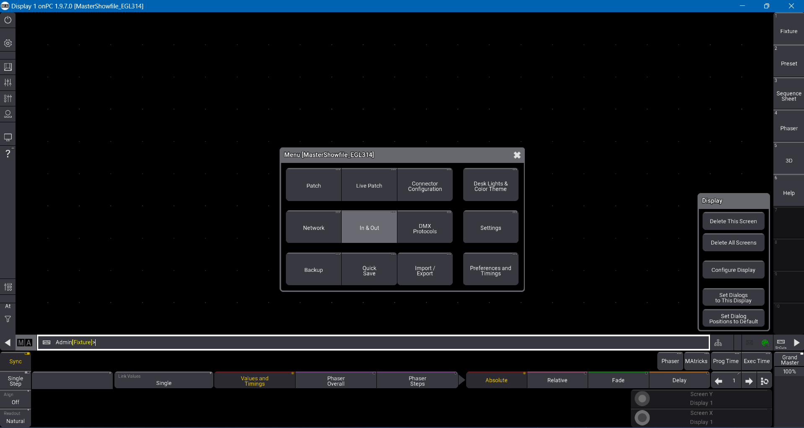
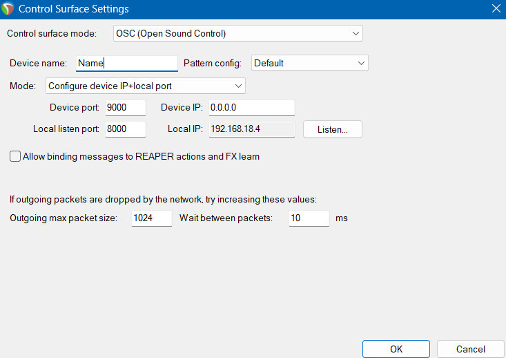

<h1 align="center">
  Installation Guide
</h1>

 <i align="center">Installation guide for Station 5 - Memory Sequence </i>

## Overview

Project S.O.N.I.C. is an experiential/exploratory initiative designed to blend the ancient “ninja training techniques” with modern technology. All of its stations are designed to be player interactive, simulating ninja training.

Its fifth station, titled Memory Sequence, is a test involving the memory of hearing. Players will listen to a complex sequence of a variety of sounds, and listen out for a specific type of sound being played. After the sequence ends, the players must indicate how many times the sound is played, and from what direction it came from.

A Master station shall be used, where every station shares the same master laptop, lighting console, the lighting fixtures, the digital audio mixer, and the 12 speaker outputs.

Credits to [Huats Club](https://github.com/huats-club) for code used in our project.

## Requirements for pre-installation

Before installation, it is important to have the following software on your laptop:

Lighting:

- [grandMA3 on PC](https://www.malighting.com/downloads/products/grandma3/) (This is the software to run and control lighting sequences)

Audio:

- [LoopMIDI](https://www.tobias-erichsen.de/software/loopmidi.html) (Create virtual loopback MIDI ports to connect apps needing MIDI ports for communication)
- [Reaper DAW](https://www.reaper.fm/download.php)(Digital Audio Workstation to use for inserting sound effects)
- [L-ISA Controller](https://www.l-acoustics.com/products/l-isa-studio/) (Spatial object mixing software to create an immersive soundscape)
- L-ISA Processor (Installed with L-ISA Controller)

## Steps and instructions for Installation

### Raspberry Pi Configuration

From Raspberry Pi, it's not possible to control grandMA3 or Reaper with default configurations. Hence, head over [here](https://github.com/huats-club/mts_sensor_cookbook/blob/main/0.%20virtual_environment/venv.md) to download a virtual environment for Raspberry Pi, which allows for downloading of packages to make controlling possible.

### Connectivity between grandMA3 and Raspberry Pi:

#### grandMA3

1) After launching grandMA3, head over to `Settings` -> `In & Out`

2) Head to `OSC` Tab

3) Ensure IP address, port and prefix are set as needed.

4) `Enable Output`, `Enable Input`, `Receive`, `Recieve Command`, `Echo Input` should all be enabled, as Raspberry Pi will be sending OSC commands to grandMA3.

#### Raspberry Pi

Head over [here](https://github.com/huats-club/oscstarterkit/tree/main/tutorial5) to download the sample Python file to your virtual environment in Raspberry Pi.

In the file, remember to change `PI_A_ADDR` to your laptop IP, and the port you set on grandMA3 earlier.

### Connectivity between Reaper and Raspberry Pi:

#### Reaper

1) Use the shortcut `Ctrl+P` to go to Reaper Preferences 
2) Scroll all the way to the bottom to Control/OSC/Web
3) Click on `Add` to add a new OSC device 

4) Configure the settings as such:

- Control Surface Mode set to `OSC (Open Source Control)`
- Mode set to `Configure device IP+local port`
- Device port set to Transmit Port number
- Local listen port set to Receive Port number
- Device IP set to 0.0.0.0
- Local IP set to your laptop's IP address

#### Raspberry Pi

Head over [here](https://github.com/huats-club/oscstarterkit/tree/main/tutorial8) to download the two sample python files to your virtual environment in Raspberry Pi.

In the files, remember to change `PI_A_ADDR` to your laptop IP, and the port to the local listen port/receive port number.