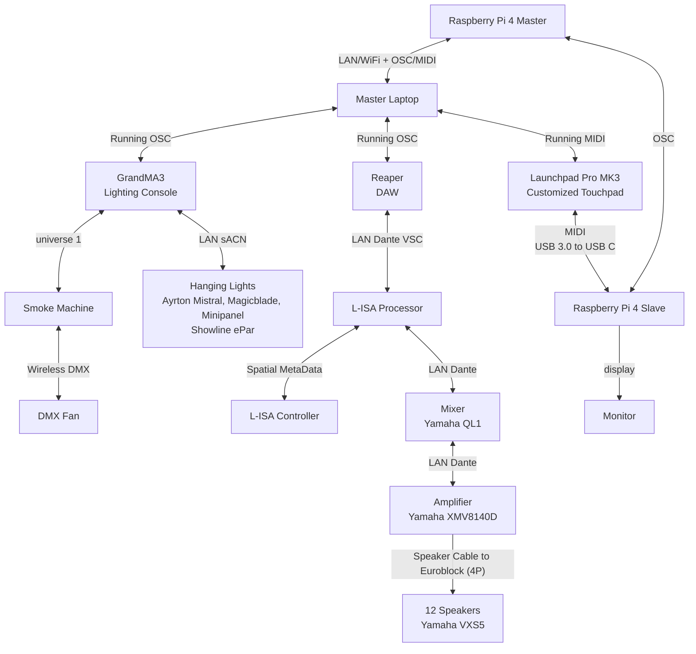

## System Diagram:

```mermaid
graph TD
A[Raspberry Pi 4 Master] <--LAN/WiFi + OSC/MIDI --> B[Master Laptop]

B <--Running OSC--> C[Reaper DAW]
B <--Running OSC--> D[GrandMA3<br>Lighting Console]
B <--Running MIDI--> K[Launchpad Pro MK3<br>Customized Touchpad]


C[Reaper<br>DAW] <--LAN Dante VSC --> F[L-ISA Processor]

D <--LAN sACN--> E[Hanging Lights<br>Ayrton Mistral, Magicblade, Minipanel<br>Showline ePar]
D <--universe 1--> M[Smoke Machine]
M <--Wireless DMX--> N[DMX Fan]

F <--Spatial MetaData--> G[L-ISA Controller]
F <--LAN Dante--> H[Mixer<br>Yamaha QL1]
H <--LAN Dante--> I[Amplifier<br>Yamaha XMV8140D]
I --Speaker Cable to Euroblock (4P)--> J[12 Speakers<br>Yamaha VXS5]

K <--MIDI<br>USB 3.0 to USB C--> L[Raspberry Pi 4 Slave]
L --display--> O[Monitor]
L <--OSC--> A 
```