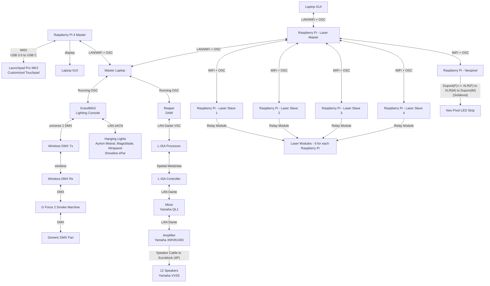

<h1 align="center">
  Final Presentation
</h1>

  <i align="center">A rundown of our station, delivered on our Final Presentation
  </i>

### Table Of Contents 📚

- [Overview](#overview) 📃
- [Backstory](#backstory) 📖
- [Getting Started!](#getting-started) 🔛
- [Software & Hardware Setup](#setup) ⚙️

## <a id="overview"> Overview 📃</a>
This repository folder contains all the notable assets, codes and others used for our Final Presentation that covers our station - Memory Sequence.

We will be using a Master Station shared with others. The Master Station hosts 3 different open-source softwares; Reaper, L-ISA Controller and GrandMA3. Besides software, there are 12 speakers in a 10m by 10m room shared too.

The final demonstration will feature a full run through of our station. This includes an introduction, 2 difficulty levels, followed by a win/lose sequence. Once the game ends, we are to segway into our laser show as a wrap up. 

## <a id="backstory"> Backstory 📖</a>
This is the lore of our station (and the previous one too!)

For some background, the previous station have you as a ninja running away from some henchmen. Approaching our station, you have escaped them, but ventured out so far that you got lost into unknown territory. Fortunately, a fellow ninja has come to your help with the Ninja Pulse™.

The Ninja Pulse™ is capable of translating sounds into directions, and you're supposed to listen out for a special type of shuriken that will be heard a certain amount of times from your left and right (and front and back on Hard Mode). Once the sound stops, you are to remember the order AND amount of shurikens played, and input them accordingly onto the Ninja Pulse™.

If you win, then congratulations! You have made your way out! 😀

If you lose, you'll be punished with smoke as the fog begins to settle in your area. 😥

## <a id="getting-started"> Getting Started 🔛</a>
### Installation Guide

1️⃣ Your first stop! [Take a gander](https://github.com/uselesskcid/EGL314-Project-S.O.N.I.C-Team-C-POC/blob/main/Final_Presentation/Installation/Installation_Guide.md) as to how we installed everything, as well as how you can do it too.

### Software & Hardware Overview

🔳 Sound effects in our levels are ran through <b>Reaper.</b> [Dive deeper](https://github.com/uselesskcid/EGL314-Project-S.O.N.I.C-Team-C-POC/blob/main/Final_Presentation/Reaper_DAW/Reaper.md) into the behind-the-scenes of our level creations.

🔲 <b>L-ISA's</b> spatial object mixing takes our gameplay one step higher. [Go in-depth](https://github.com/uselesskcid/EGL314-Project-S.O.N.I.C-Team-C-POC/blob/main/Final_Presentation/L-ISA_Controller/L-ISA.md) into the specifics of what goes on.

🔳 <b>grandMA3</b> provides a lighting control platform for our station. [Watch](https://github.com/uselesskcid/EGL314-Project-S.O.N.I.C-Team-C-POC/blob/main/Final_Presentation/GrandMA3/grandma3.md) as our work comes to light.

🔲 Our softwares used are operated by <b>PythonOSC.</b> [See how](https://github.com/uselesskcid/EGL314-Project-S.O.N.I.C-Team-C-POC/blob/main/Final_Presentation/OSC/OSC.md) a humble laptop can control our entire system.

🔳 We had the privilege of using a <b>Launchpad</b> for our gameplay. [Dig into](https://github.com/uselesskcid/EGL314-Project-S.O.N.I.C-Team-C-POC/blob/main/Final_Presentation/Launchpad_(Ninja_Pulse)/Launchpad.md) how we utilised its power.

🔲 Besides gameplay, we contributed to a remarkable <b>laser show</b>. [Take a look](https://github.com/uselesskcid/EGL314-Project-S.O.N.I.C-Team-C-POC/blob/main/Final_Presentation/Laser_Sequence/Laser.md) at the flashy lights and their set-up.

### Slides
Many groups use a poster. We went for [a slightly different approach](https://github.com/uselesskcid/EGL314-Project-S.O.N.I.C-Team-C-POC/blob/main/Final_Presentation/Slides).

## <a id="setup"> Software & Hardware Setup ⚙️</a>
