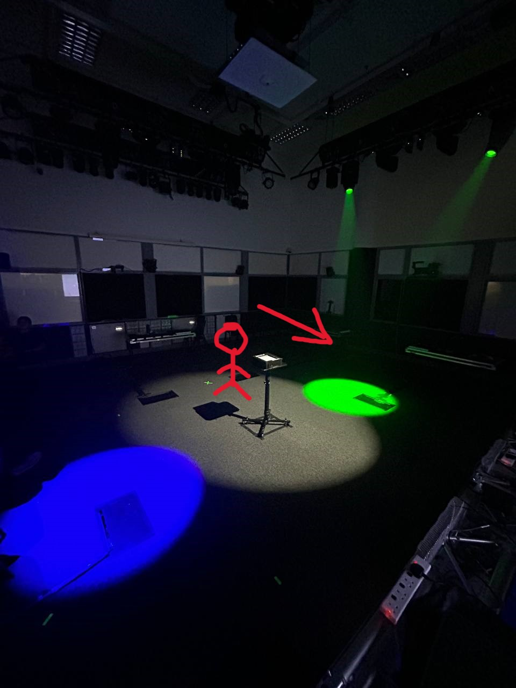

<h1 align="center">
GrandMA3
</h1>

  <i align="center">
  Rundown of lighting sequences in GrandMA3.
  </i>

### Table Of Contents 📚

- [Overview](#overview) 📃
- [Files In Use](#files-in-use) 📂
- [Master GrandMA3 show file](#Master-ShowFile) 📄
- [Picture Assets](#Pictures)

## <a id="overview"> Overview 📃</a>

GrandMA3 is a open-source software with a sophisticated lighting control system widely used in the entertainment industry.
It's the third generation of the popular grandMA lighting console series, offering advanced features and capabilities.

## <a id="files-in-use"> Files In Use 📂</a>

📄 - [Master GrandMA3 show file](https://github.com/uselesskcid/EGL314-Project-S.O.N.I.C-Team-C-POC/tree/main/Final_Presentation/GrandMA3/FinalTry.show)

This the GrandMA3 show file that runs on the Master Station Laptop. It contains not just the pre-programmed lighting sequences and patched lighting fixtures for Station 5, but also the other 4 stations and also the light and laser show.

## <a id="Pictures"> Picture Assets </a>

This is a picture of the lighting sequence for <b>Easy Level</b> of our station. The lights are pointed onto the floor to help guide players that are playing the game. White light is also shine to help players to see.

This is a picture of the lighting sequence for <b>Hard Level</b> of our station. The lights are pointed onto the floor to help guide players that are playing the game. White light is also shine to help players to see.

