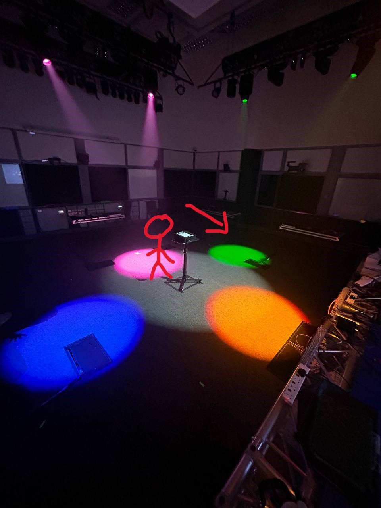

<h1 align="center">
GrandMA3
</h1>

  <i align="center">
  Rundown of lighting sequences in GrandMA3.
  </i>

### Table Of Contents 📚

- [Overview](#overview) 📃
- [Files In Use](#files-in-use) 📂
- [Master GrandMA3 show file](#Master-ShowFile) 📄
- [Equipment](#equipment) 🖥
- [Pictures](#Pictures) 🖼️

## <a id="overview"> Overview 📃</a>

GrandMA3 is a open-source software with a sophisticated lighting control system widely used in the entertainment industry.
It's the third generation of the popular grandMA lighting console series, offering advanced features and capabilities.

## <a id="files-in-use"> Files In Use 📂</a>

📄 - [Master GrandMA3 show file](https://github.com/uselesskcid/EGL314-Project-S.O.N.I.C-Team-C-POC/tree/main/Final_Presentation/GrandMA3/FinalTry.show)

This the GrandMA3 show file that runs on the Master Station Laptop. It contains not just the pre-programmed lighting sequences and patched lighting fixtures for Station 5, but also the other 4 stations and also the light and laser show.

## <a id="equipment"> Equipment </a> 🖥

Our lighting setup consists of a total 8 Ayrton MiniPanels, 8 Ayrton MagicBlades, 8 Ayrton Mistrals and 8 Showline ePar 180s, 2 each for each side of the room. Additionally, we have a Le Maitre GeForce 3 Smoke Machine and a generic DMX fan connected to the grandMA3 console for our lose sequence.

For our laser show, we have a Le Maitre MVS Hazer to display the lasers clearer.

## <a id="Pictures"> Pictures </a> 🖼️

This is a picture of the lighting sequence for <b>Easy Level</b> of our station. The lights are pointed onto the floor to help guide players that are playing the game. White light is also shine to help players to see. The stick figure shows where the player would be when playing, as well as the direction to be facing.

This is a picture of the lighting sequence for <b>Hard Level</b> of our station. The lights are pointed onto the floor to help guide players that are playing the game. White light is also shine to help players to see. The stick figure once again shows where the player would be when playing, as well as the direction to be facing.

