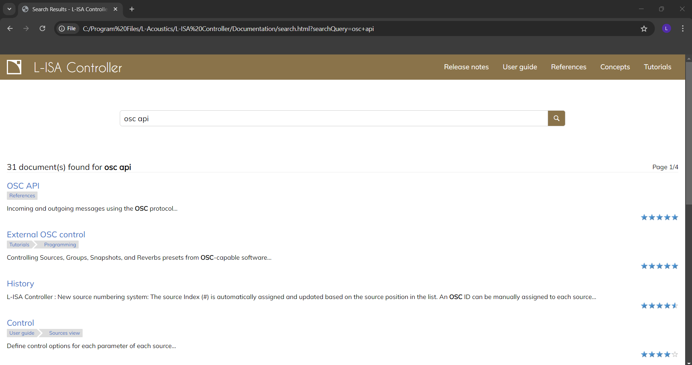

<h1 align="center">
  Installation Guide
</h1>

<p align="center">
<i align="center">Installation guide for our project. </i>
</p>

## Table Of Contents 📚

<b>

- [Overview](#overview) 📃
- [PythonOSC Installation](#python-osc) ⚙️
- [grandMA3 Configuration](#grandma3) 💡
- [Reaper Configuration](#reaper) 🎛️
  - [Raspberry Pi to Reaper](#rasp-pi-reaper) 🔗
- [L-ISA Configuration](#lisa) 🔊
  - [L-ISA Processor](#lisa-processor) ⬛
  - [L-ISA Controller](#lisa-controller) 🟦
  - [Raspberry Pi to L-ISA](#rasp-pi-lisa) 🔗
  - [Reaper to L-ISA](#reaper-lisa) 🔗
- [Launchpad Configuration](#launchpad) 📱
- [References](#references) 📋

</b>

## <a id="overview"> Overview 📃</a>

This installation guide serves to build the foundation of our project. It will heavily revolve around PythonOSC as it is our method of control.

Before installation, it is important to have the following software on your device(s):

- [grandMA3 on PC](https://www.malighting.com/downloads/products/grandma3/) (This is the software to run and control lighting sequences)
- [LoopMIDI](https://www.tobias-erichsen.de/software/loopmidi.html) (Create virtual loopback MIDI ports to connect apps needing MIDI ports for communication)
- [Reaper DAW](https://www.reaper.fm/download.php) (Digital Audio Workstation for inserting sound effects)
- [L-ISA Controller](https://www.l-acoustics.com/products/l-isa-studio/) (Spatial live object mixing software to create an immersive soundscape)
- L-ISA Processor (Installed with L-ISA Controller)

Additionally, a [Launchpad](https://novationmusic.com/search.php?search_query=launchpad) is used in our set-up.

References can be found below.

## <a id="python-osc"> PythonOSC Installation ⚙️</a>

Unfortunately with default configurations, it isn't possible to install packages using pip, a package installer for Python.

To bypass, it's necessary to download a virtual environment on your Raspberry Pi. Then, installing and running PythonOSC on it will be authorised.

1) Install Python virtual environment

```
sudo apt install virtualenv python3-virtualenv -y
```

2) Create a new virtual environment

```
virtualenv -p /usr/bin/python3 <environment_name>
```

3) Activate the virtual environment

```
source <environment_folder>/bin/activate
```

4) Install the PythonOSC package

```
pip3 install python-osc
```

### Optional:

- Deactivate the virtual environment

```
deactivate
```

- Copy the virtual environment

First, generate a requirement file at the current working directory.

```
pip3 freeze > requirements.txt
```

Next, install dependencies in new enviroment

```
source <environment_folder>/bin/activate
```

```
pip3 install -r ~/<directory>/requirements.txt
```
## <a id="grandma3"> grandMA3 Configuration 💡</a>

1) After launching grandMA3, head over to `Settings` > `In & Out`


2) Head to `OSC` Tab

3) Ensure IP address, port and prefix are set as needed. It is advised to set the prefix to `gma3`.

4) `Enable Output`, `Enable Input`, `Receive`, `Recieve Command`, `Echo Input` should all be enabled, as Raspberry Pi will be sending OSC commands to grandMA3.


### Raspberry Pi to grandMA3 🔗
1) Create a file directory for grandMA3.
```
mkdir <directory_name>
```

2) Copy this [sample file](https://github.com/huats-club/oscstarterkit/tree/main/tutorial5/grandma.py) and insert it into your directory.

3) Remember to change `LAPTOP_IP` to your laptop IP, and ```PORT``` you set on grandMA3 earlier.

```
if __name__ == "__main__":
    LAPTOP_IP = "192.168.0.100"		# send to laptop w grandMA3
    PORT = 8000                     # laptop w grandMA3 port number
```
4) Run the file.
```
python3 grandma.py
```

## <a id="reaper">Reaper Configuration 🎛️</a>

1) Use the shortcut `Ctrl+P` to go to Reaper Preferences 
2) Scroll all the way to the bottom to `Control/OSC/web`
3) Click on `Add` to add a new OSC device 


4) Configure the settings as such:

- Control Surface Mode set to `OSC (Open Source Control)`
- Mode set to `Configure device IP+local port`
- Device port set to Transmit Port number
- Local listen port set to Receive Port number
- Device IP set to `0.0.0.0`
- Local IP set to your laptop's IP address


### <a id="rasp-pi-reaper"> Raspberry Pi to Reaper 🔗</a>

1) Create a file directory for Reaper. (Reusing the grandMA3 directory is also fine)
```
mkdir <directory_name>
```

2) Copy this [sample file for Reaper markers](https://github.com/huats-club/oscstarterkit/tree/main/tutorial8/marker_1.py) and this [sample file for Reaper playback](https://github.com/huats-club/oscstarterkit/tree/main/tutorial8/play_stop.py) and insert them both into your directory.

3) Edit the IP addresses of both files. `PI_A_ADDR` should be the laptop running Reaper, and ```PORT``` should be the local listen port/receive port number.

```
PI_A_ADDR = "10.10.10.10"
PORT = 6800
```

4) Run both files.

```
python3 marker_1.py
python3 play_stop.py
```

## <a id="lisa">L-ISA Configuration 🔊</a>

### <a id="lisa-processor">L-ISA Processor ⬛</a>

1) Launch L-ISA Processor.

2) Under `Audio Device Type`, select `ASIO`.

3) Under `Output`, select `Dante Virtual Soundcard`.


4) On L-ISA Controller, go to `Processors`.

5) Under `Main`, select `ASIO`.

6) Click `Connect`.


7) Under a successful connection, you should see the following in the red boxes change.


### <a id="lisa-controller">L-ISA Controller 🟦</a>

1) Launch L-ISA Controller (if not done so)

2) Navigate to `Settings`.

3) Navigate to `OSC`.

4) Under the IP address column, change the IP address from 127.0.0.1 to the IP of your Raspberry Pi.

5) Turn ON `Receive From` and `Levels Control`.


6) Once finished, navigate to `Sources`.

7) Under the column `Ext OSC`, enable Pan (P), Width (W), Distance (D), Elevation (E), and Aux Send (S).

8) Insert OSC ID for each source.


### <a id="rasp-pi-lisa"> Raspberry Pi to L-ISA 🔗</a>

1) Create a file directory for L-ISA.
```
mkdir <directory_name>
```

2) Copy this [sample file for adjusting pan value](https://github.com/huats-club/oscstarterkit/blob/main/tutorial7/lisa_mv.py) and this [sample file for triggering the next snapshot](https://github.com/huats-club/oscstarterkit/blob/main/tutorial7/lisa_snap.py) and insert them both into your directory.

3) Edit the IP addresses of both files. `PI_A_ADDR` should be the laptop running L-ISA, and ```PORT``` should be fixated at 8880.

```
PI_A_ADDR = "10.10.10.10"
PORT = 8880
```
<b> Do not change the port number, otherwise L-ISA Controller will not receive via OSC.</b>

4) Run both files. For `lisa_snap.py` to show changes, two or more snapshots must be created first.

```
python3 lisa_mv.py
python3 lisa_snap.py
```

### Optional:

Besides changing pan values and triggering the next snapshot, it's possible to do more.

First, launch L-ISA Controller and press `F1` on your keyboard. You should be redirected to this page on your web browser.


This page contains extensive documentation on the L-ISA Controller, such as user guides, troubleshooting, and advanced concepts. It is highly recommended for beginners or for those who would like to dive deeper into the software.

The focus here will be on more OSC commands, so type `OSC API` into the search bar. Click the first result named `OSC API`.



In this page, there are many commands listed to give more precise control of L-ISA Controller. After finding an applicable function, copy the address (change source number if needed) and insert it in the sample files accordingly.


### <a id="reaper-lisa"> Reaper to L-ISA 🔗</a>

#### loopMIDI

1) Launch loopMIDI. Do not close it when Reaper & L-ISA are running.

2) Name your new MIDI port and create it.


#### Reaper

3) Launch Reaper.

4) Use the shortcut `Ctrl+P` to go to Reaper Preferences 

5) Scroll to `Audio` > `MIDI Devices`. You should see your MIDI port created earlier on both MIDI inputs and outputs.

6) Click to enable the port on the output (should be marked with a black dot)


7) Exit Preferences and return to the main page.

8) Go down to the Mixer section, and click the MIDI output button.

9) Under `MIDI Hardware Output`, change the output to the loopMIDI port you created.

10) Repeat steps 8 to 9 for every track used.

11) At the top panel, click `Insert`.

12) Click `SMPTE LTC/MTC Timecode Generator`. Drag it such that the start matches the start of the timeline, and extend longer if necessary.


#### L-ISA

13) Launch L-ISA Controller.

14) Navigate to `Settings`.

15) Navigate to `MIDI`.

16) Under MIDI Interface, click MTC. The button should be fully white.

17) Return to Reaper and test playback. If all's working well, the MIDI activity will turn green and the MTC timer will sync with Reaper.


## <a id="launchpad">Launchpad Configuration 📱</a>

### Raspberry Pi to Launchpad 🔗

The Launchpad is the only device not controlled via PythonOSC. Instead, it uses MIDI for control.

For this, we need to import the mido library. It stores most of the functions that we will be coding for our game to function.
```
import mido
```

Then, you will need create two variables and each variable opens the input port and output port for recieving MIDI messages and sending them.

```
# Example:

outport = mido.open_output('Launchpad Pro MK3:Launchpad Pro MK3 LPProMK3 MIDI 28:0')
inport = mido.open_input('Launchpad Pro MK3:Launchpad Pro MK3 LPProMK3 MIDI 28:0')
```
>  - "outport" and "inport" are variables.
>  - "mido.open_output" and "mido.open_input" are both functions from the mido library.
> - Both the mido functions state the names for the input port and output ports of the Launchpad (Both are named ***'Launchpad Pro MK3:Launchpad Pro MK3 LPProMK3 MIDI 28:0'***) in order to open these ports for Launchpad and Raspberry Pi MIDI communication.

### Appearance Customisation
To add colour to the LEDs, we would need to assign a colour code to the ID number of the LEDs. To find out the colour codes of the Launchpad, refer to the [Launchpad Pro Programmer's Manual.]((https://fael-downloads-prod.focusrite.com/customer/prod/s3fs-public/downloads/LPP3_prog_ref_guide_200415.pdf))

We need to start off by sending this output message to the Launchpad in order to tell it to light up 1 LED with a desired colour.
```
# Example 
def pixel(buttonid, colour):
     outport.send(mido.Message('note_on', note=buttonid, velocity=colour))
```


The output port sends a MIDI message to the Launchpad.  `note_on` tells the LED to light up.

For the Launchpad, `note` is referred to as the button ID of an LED, and `velocity` is referred to the colour of the LED to light up.

`pixel(buttonid, colour)` is defined as a function to light up 1 LED with a specific colour.

## <a id="references">References 📋</a>
Credits to [Huats Club](https://github.com/huats-club) for the following references:

🔗 - [Virtual environment & PythonOSC installation](https://github.com/huats-club/mts_sensor_cookbook/blob/main/0.%20virtual_environment/venv.md)

🔗 - [grandMA3 Configuration](https://github.com/huats-club/oscstarterkit/tree/main/tutorial5)

🔗 - [Reaper Configuration](https://github.com/huats-club/oscstarterkit/tree/main/tutorial8)

🔗 - [L-ISA Configuration](https://github.com/huats-club/oscstarterkit/tree/main/tutorial7)

🔗 - [MIDI Configuration](https://github.com/huats-club/mts_sensor_cookbook/blob/main/4.%20midi/midi.md)