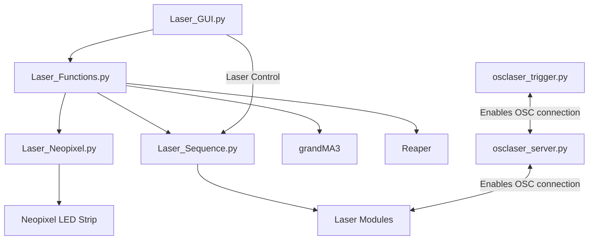
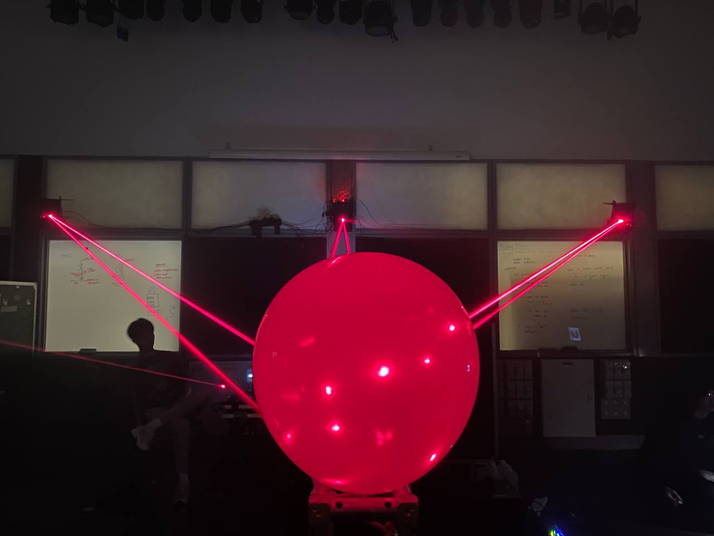
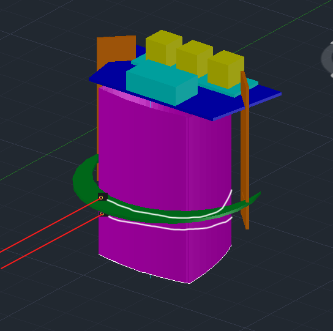
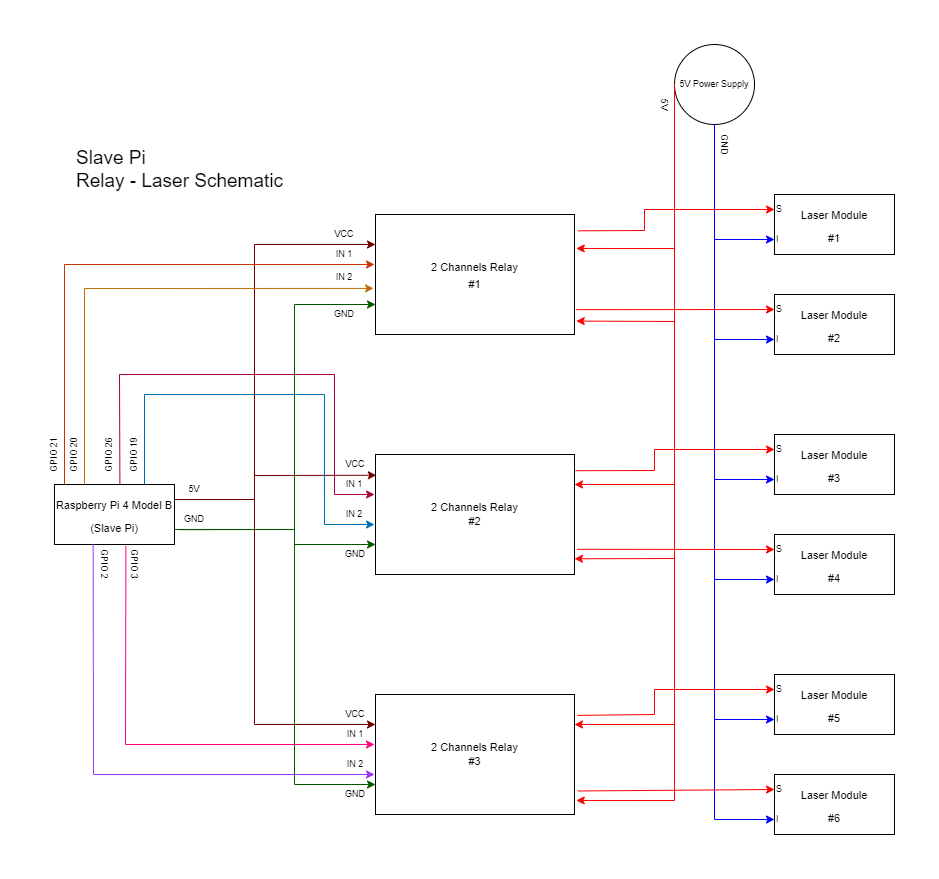

<h1 align="center">
Laser Sequence
</h1>

<p align="center">
  <i align="center">
  Rundown of laser sequence software and hardware
  </i>
</p>

### Table Of Contents 📚

<b>

- [Overview](#overview) 📃
- [Files In Use](#files-in-use) 📂
- [Code Hierarchy](#hierarchy) 👑
- [Hardware Setup](#hardware) ⚙️
  - [Mount Setup](#hardware-mount) 🏗️
  - [Electrical Setup](#hardware-electrical) ⚡
- [Software Overview](#software) 💻
  - [Song Choice](#software-song) 🎵
  - [NeoPixel Lighting](#software-np) 💡

</b>

## <a id="overview"> Overview 📃</a>

To conclude guests visiting all 5 stations, we are to program a minute long laser and lighting show.

Audio wise, it has to be upbeat, electrifying and immersive. Lighting and laser sequences have to be synced to match the audio, with lasers displayed onto a spherical canvas.

The setup will be 2 lasers at the center of each wall of the room, for a total of 8 lasers. They'll point directly to the center of the room onto the spherical canvas. In our case, we used a balloon. The balloon will be held up by a truss with Neopixel LED strips snaking around it. We're then given the liberty to program the lasers, LED strips and lighting as we so chose.

We were given the honour to have our sequence chosen to showcase to industry guests at the end of the semester.

## <a id="files-in-use"> Files In Use 📂</a>

📄 - [Laser Neopixel](https://github.com/uselesskcid/EGL314-Project-S.O.N.I.C-Team-C-POC/blob/main/Final_Presentation/Codes/FP_Laser_Neopixel.py)

Contains control for Neopixel strip used.

📄 - [Laser Sequence](https://github.com/uselesskcid/EGL314-Project-S.O.N.I.C-Team-C-POC/blob/main/Final_Presentation/Codes/FP_Laser_Sequence.py)

Contains control for lasers used in the sequence. Also has individual, team, or absolute laser control built in.

📄 - [Laser Functions](https://github.com/uselesskcid/EGL314-Project-S.O.N.I.C-Team-C-POC/blob/main/Final_Presentation/Codes/FP_Laser_Functions.py)

A mini function storage to control Reaper, grandMA3, and of course the lasers and Neopixel.

📄 - [Laser GUI](https://github.com/uselesskcid/EGL314-Project-S.O.N.I.C-Team-C-POC/blob/main/Final_Presentation/Codes/FP_Laser_GUI.py)

The GUI of the sequence. Connected to Sequence for easier laser control.

📄 - [Laser OSC Trigger](https://github.com/uselesskcid/EGL314-Project-S.O.N.I.C-Team-C-POC/blob/main/Final_Presentation/Codes/FP_Laser_osclaser_trigger.py)

Enables OSC "listening" for the Raspberry Pi connected to the relay modules.

📄 - [Laser OSC Server](https://github.com/uselesskcid/EGL314-Project-S.O.N.I.C-Team-C-POC/blob/main/Final_Presentation/Codes/FP_Laser_osclaser_server.py) 🚫 NOT IN USE BY US 🚫

Enables all lasers to be controlled via OSC.
## <a id="hierarchy"> Code Hierarchy 👑</a>

Illustrating how the codes function together under the laser section.


## <a id="hardware"> Hardware Setup ⚙️</a>

### <a id="hardware-mount"> Mount Setup 🏗️</a>
The lasers will be setup on a mount above the center speaker. This way, the lasers get to be fully showcased to guests who'd be sitting down.



> Originally, we had 3 speakers with mounts supporting the lasers. Additionally, it was supposed to reflect off a mirror placed on the speaker to create a pattern on the balloon (watch [this video](https://www.youtube.com/watch?v=C-V1uXeyGmg) to learn more). Since then, things have changed, and now only the center speaker is used, with lasers pointed directly at the balloon.

To create the mount, an arc, two walls, and a platform is used to hold all of our hardware together. Most notably:

- the Raspberry Pi to run the lasers
- relay modules acting as a control system
- of course, the laser modules themselves

The picture below illustrates how it would be setup, as well as possible placement of laser modules. The white lines represents cables that connect the laser modules to the relay modules.


> Legend:
>- Pink: Speaker
>- Green: Arc
>- Orange: Walls
>- Blue: Platform
>- Cyan: Raspberry Pi
>- Flat Cyan: Breadboard
>- Yellow: Relay Modules


### <a id="hardware-electrical"> Electrical Setup ⚡</a>

As previously mentioned, the laser modules are connected to the relay modules, while the relay modules are connected to the GPIO pins of the Raspberry Pi. A 5V power supply powers the relay modules, while the Raspberry Pi is seperately powered by its own charger.



Both the Raspberry Pi charger and the 5V power supply are connected to a power strip attached nearby.

## <a id="software"> Software Overview 💻</a>

### <a id="software-song"> Song Choice 🎵</a>

The audio for our sequence is a trap beat mixed together with an ancient Japanese instrumental track. This gives a modern upbeat feeling, while simulatenously maintaining an ancient sound impression, which ties back to our objective.

<audio controls src="laser_assets/Laser_Sequence_Song.wav" title="Song">
Your browser does not support the audio element.
</audio>

Song playback not showing up?  Click [here](https://github.com/uselesskcid/EGL314-Project-S.O.N.I.C-Team-C-POC/blob/main/Final_Presentation/Laser_Sequence/laser_assets/Laser_Sequence_Song.wav) to navigate to the song.

### <a id="software-np"> Neopixel Lighting 💡</a>

The NeoPixel lighting works by creating a client for both strips on the truss and balloon, followed by a function that triggers colours through RGB coding.
```
TRUSS_IP = "192.168.254.242"  # Change to your Truss RPi's IP address
TRUSS_PORT = 2005

BALLOON_IP = "192.168.254.102"  # Change to your Balloon RPi's IP address
BALLOON_PORT = 2006

# Create OSC clients
truss_client = udp_client.SimpleUDPClient(TRUSS_IP, TRUSS_PORT)
balloon_client = udp_client.SimpleUDPClient(BALLOON_IP, BALLOON_PORT)

def send_color_array_truss(colors):
    address = "/color_array"
    flattened_colors = [color for rgb in colors for color in rgb]
    truss_client.send_message(address, flattened_colors)

def red_blink_sequence(NUM_PIXELS, duration):
    red_end_time = time.time() + duration
    colors_sequence = [
        (255, 0, 0),  # Red
        (255, 255, 255) # white
    ]
    
    while time.time() < red_end_time:
        for color in colors_sequence:
            blink_color(NUM_PIXELS, color, 1.2)  # Blink each color for 2 seconds
```

`time.sleep()` can be used to adjust intervals and durations between each segments.


