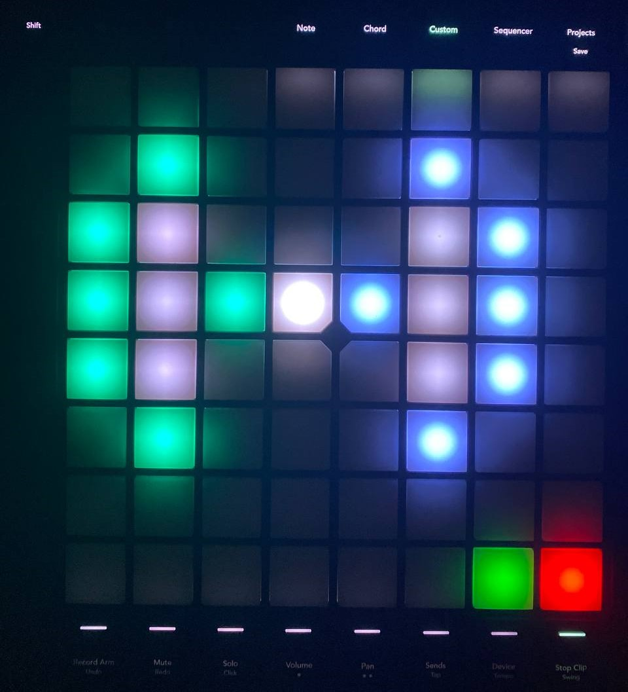

<h1 align="center">
Memory Sequence: Game Controller
</h1>

<p align="center">
<i align="center">Touch-based gamepad using Novation's Launchpad Pro MK3 </i>
</p>


## Overview
For the **Memory Sequence** game portion of Project S.O.N.I.C, we will be using the ***Launchpad Pro MK3*** as our MIDI touchpad. The game pad will be accomodating 2 of our essential gamemodes: easy and hard. The player will be able to play using the central buttons on the Launchpad and switch between easy 


# Getting started


We will be connecting our ***Launchpad*** to our ***Rasberry Pi 4*** with a ***USB-C to USB-A cable*** through their respective ports. After which we will be coding on the Raspberry Pi using ```Python```. 

Several things to note before proceeding:

-  Ensure that your Raspberry Pi is updated. (e.g date and time, etc) 

-  Make sure you are running a virtual environment (Create if you do not have one, refer to [here](https://github.com/huats-club/mts_sensor_cookbook/blob/main/0.%20virtual_environment/venv.md) for more details)

-  Make sure that you have **python-osc** downloaded in your virtual environment.

> You should now be running your virtual environment on your Raspberry Pi terminal.


Now, install the following module inside your virtual environment:


     
    pip install mido
     
  After you have installed the module, you can proceed to check the **input and outport ports** of your Launchpad. We will need the **MIDI input port** in order to get our code to run from our Raspberry Pi to our Launchpad.  
       
     
   Connect your Launchpad to your Rasberry Pi first using your USB-C to USB-A cable, then put in the following code on a python file and run it on your virtual environment:
   ```
import mido

# List all inpuport midot MIDI devices
    print("Input MIDI Devices:")
    for input_name in mido.get_input_names():
    print(input_name)

# List all output MIDI devices
    print("\nOutput MIDI Devices:")
    for output_name in mido.get_output_names():
    print(output_name)

     
  ```
     
You would then be able to see three input ports from your Launchpad. Note down the one with the MIDI input port.
     
Then, we will need to find the ID number for each LED on the Launchpad to start configuring our buttons as well as assigning colours to each LED on the Launchpad. 


 

>- On the central area of your Launchpad, there is an 8x8 LED layout in which the LEDS can be controlled with their respective numerical ID numbers. You will need to use those ID numbers inside your code in order to configure your LED lights and buttons.     

You can choose to refer to the [Launchpad Pro MK3's Programmer's manual](https://fael-downloads-prod.focusrite.com/customer/prod/s3fs-public/downloads/LPP3_prog_ref_guide_200415.pdf), or you can follow the tutorial on [huats-club.](https://github.com/huats-club/mts_sensor_cookbook/blob/main/4.%20midi/midi.md)


### Starting your Launchpad
Activate your Launchpad's **Custom Mode 8**. This is where our game will be played with the touch LED buttons. 

**Hit the "Custom" button and then the 8th bottom button on the far right.**
 


 

 ***If you want to reset your LED lights/buttons, switch to another custom mode then come back to custom mode 8. The LED lights of the touch buttons will disappear.***


# Gameplay Development

## Our Gamepad


You are greeted with a single start buttton on the Launchpad.
 
 After the start button is pressed, the layout of the starting game mode will appear to signify the start of game. 
 
 On the bottom right hand corner,
 there are two buttons to switch between difficulty modes with green loading the easy mode and red loading the hard mode.


 
 ### Easy mode (Green)
 
 


 >The easy mode consists of the most basic directions: Left and Right.
 ### Hard mode (Red)

 
 >The hard mode consists of four directions: North, South, East and West, with the playable buttons being inside the white circle.

For each game mode, the layout represents the directions the player has to look out for in an environment.
- The environment includes different colours representing different directions of sound.(excluding the hard and easy mode buttons)
- The directional buttons are coloured according to respective their directions.
- The white LED on the center of the layout represents the player's position


## How the code works


We made 3 ```python``` files: one for easymode, one for hard mode and then another one for the main code that we will be using to run the overall code to operate our whole game.

- Main file : **[POC_Launchpad.py](https://github.com/uselesskcid/EGL314-Project-S.O.N.I.C-Team-C-POC/blob/main/Launchpad%20Pro/POC_Launchpad.py)**

- Easy mode file: **[POC_LP_EasyMode.py](https://github.com/uselesskcid/EGL314-Project-S.O.N.I.C-Team-C-POC/blob/main/Launchpad%20Pro/POC_LP_EasyMode.py)**

- Hard mode file: **[POC_LP_HardMode.py](https://github.com/uselesskcid/EGL314-Project-S.O.N.I.C-Team-C-POC/blob/main/Launchpad%20Pro/POC_LP_HardMode.py)**

For all three files, we need to start off by making sure that the Raspberry Pi is can communicate with the Raspberry Pi through MIDI.


First we need to import the mido library.
```
import mido
```
 -  The "mido" library stores most of the functions that we will be coding for our game to function.

Then, you will need create two variables and each variable opens the input port and output port for recieving MIDI messages and sending MIDI commands respectively.

```

# Example:

outport = mido.open_output('Launchpad Pro MK3:Launchpad Pro MK3 LPProMK3 MIDI 28:0')
inport = mido.open_input('Launchpad Pro MK3:Launchpad Pro MK3 LPProMK3 MIDI 28:0')
```
>  - "outport" and "inport" are variables.
>  - "mido.open_output" and "mido.open_input" are both functions from the mido library.
> - Both the mido functions state the names for the input port and output ports of the Launchpad (Both are named ***'Launchpad Pro MK3:Launchpad Pro MK3 LPProMK3 MIDI 28:0'***) in order to open these ports for Launchpad and Raspberry Pi MIDI communication.

### Adding colours (All files)

To add colour to the LEDs, we would need to assign a colour code to the ID number of the LEDs. To find out the colour codes of the Launchpad, refer to the [Launchpad Pro Programmer's Manual.]((https://fael-downloads-prod.focusrite.com/customer/prod/s3fs-public/downloads/LPP3_prog_ref_guide_200415.pdf))

We need to start off by sending this output message to the Launchpad in order to tell it to light up 1 LED with a desired colour.
```

# Example 
def pixel(buttonid, colour):
     outport.send(mido.Message('note_on', note=buttonid, velocity=colour))
```
> - The output port sends a MIDI message to the Launchpad.  'note_on' tells the LED to light up.
> - For the Launchpad, 'note' is referred to as the button ID of an LED, and 'velocity' is referred to the colour of the LED to light up.
> - 'pixel(buttonid, colour)' is defined as a function to light up 1 LED with a specific colour.


After which you can start colouring your buttons. For example, if I want to colour 2 LEDs of my choice:
```
# Example:

def light_mode_buttons():
    led(17, 64)       # Colour (green)
    led(18, 72)       # Colour (red)
```

> - The numbers **17** and **18** represent the ID numbers of the two LED buttons.
> - The number **64** is the colour code for green, while the colour for red is **72**.

### Button feedback (All files)

We can also receive input feedback on our Raspberry Pi when pressing the LEDs on the Launchpad as they can also act as buttons for sending messages to the Raspberry Pi.

```
# Example 
for msg in inport:  
    if msg.type == 'note_on' or msg.type == 'note_off':
        if msg.note == 17:
            if msg.velocity != 0: 
                print("17 pressed") 
            else:  
                print("17 released)  
```


### Easy mode file
The layout for easy mode shows up when this file is loaded. Players can input the Left and Right directions with the buttons during the memory sequence.
- The code contains the colours of the design layout for Easy mode on the Launchpad. 
- 3 coloured LEDs to represent for the Left Direction, Right Direction and Submit Sequence buttons are programmed to send MIDI messages as feedback to the Raspberry Pi.
- The 3 LED buttons are implemented with **visual colour feedback** by changing colour when pressed, and returning back to its original colour.


### Hard mode file
The layout for hard mode shows up when this file is loaded. Players can input the North, South, East and West directions with the buttons during the memory sequence.
- Contains the code for the design layout for Hard mode.
- 5 colored LEDs to represent North, South, East, West and Submit Sequence  buttons coded to send MIDI feedback to the Raspberry Pi.
- Visual feedback is also implemented for user experience.


### Main file

The code file that we will only be running on our Raspberry Pi terminal is our **main file** whch is the master file that sets up the whole game and  controls the running process of each individual game mode. 
 - The start button is coded inside the main file to start and load the whole game on the Launchpad.
 - The functions of the two difficulty mode buttons are coded in the main file to switch between easy and hard mode. This means that the main file can load the easy or hard mode depending on which difficulty mode button the player presses.
- The difficulty mode buttons can be pressed when the easy or hard mode is on the Launchpad.
- More modules are imported in this file such as ```time```, ```subprocess``` and ```threading``` in order to create functions to run one difficulty mode at a time.


 


