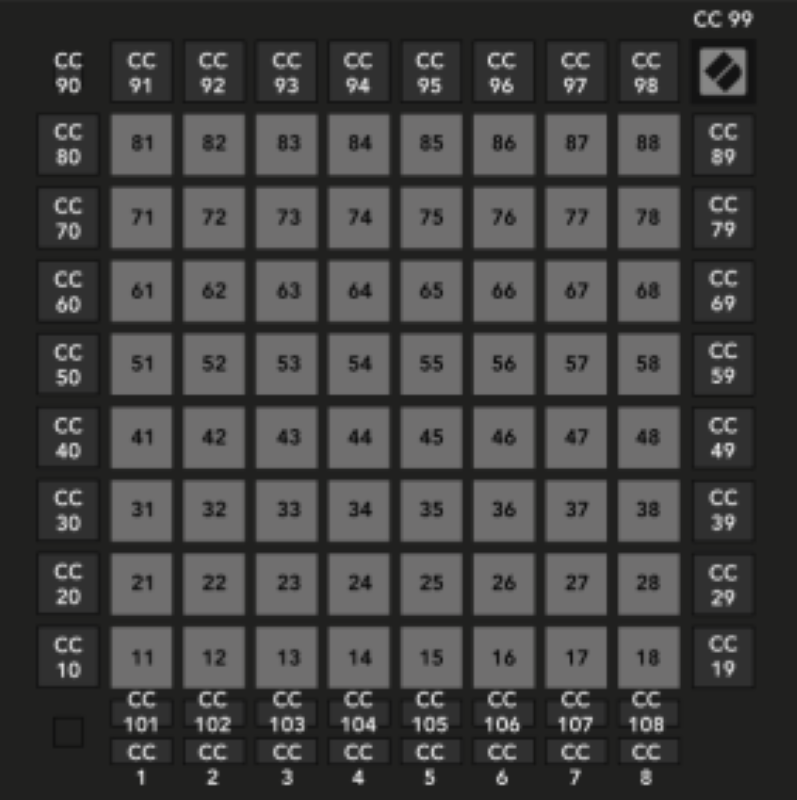

<h1 align="center">
Station 5 Game Pad
</h1>

<p align="center">
<i align="center">Touch-based gamepad using Novation's Launchpad Pro MK3 </i>
</p>


# Overview
For the **Memory Sequence** game portion of Project S.O.N.I.C, we will be using the ***Launchpad Pro MK3*** as our MIDI touchpad. The game pad will be accomodating 2 of our essential gamemodes: easy and hard. The player will be able to play using the central buttons on the Launchpad and switch between easy and hard mode with 2 buttons. 


# Programmer's Section
### Getting started

We will be connecting our ***Launchpad*** to our ***Rasberry Pi 4*** with a ***USB-C to USB-A cable*** through their respective ports. After which we will be coding inside a Rasberry Pi **python file** which we will be running on a virtual environment. We will be using 3 python files, one for easymode, one for hard mode and another for the main code that we will be using the run the two gamemode files simultaneously. 

A few things to note before proceeding:

1. Ensure that your Rasberry Pi is updated. (e.g date and time, etc) 
2. Make sure you are running on a virtual environment (Create one if you have not done so)
3. Make sure that you have downloaded **python-osc** in your virtual environment.
4. Install the following modules inside your virtual environment:


     ```
    pip install mido
     ```
      After you have installed both modules, you can proceed to check the **input and outport ports** of your Launchpad. We will need the **MIDI input port** in order to get our code to run from our Rasberry Pi to our Launchpad.  
       
     
     Connect your Launchpad to your Rasberry Pi first using your USB-C to USB-A cable, then put in the following code on a python file and run it on your virtual environment:
     ```
    import mido

    # List all inpuport midot MIDI devices
    print("Input MIDI Devices:")
    for input_name in mido.get_input_names():
    print(input_name)

    # List all output MIDI devices
    print("\nOutput MIDI Devices:")
    for output_name in mido.get_output_names():
    print(output_name)

     
     ```
     
     
     - You would then be able to see three input ports from your Launchpad. Note down the one with the MIDI input port.
     


### Starting your Launchpad
-  Activate your Launchpad's **Custom Mode 8**. This is where our game will be played with the touch LED buttons. 

**Hit the "Custom" button and then the 8th bottom button on the far right.**
 


Then, we need to find the button IDs for each LED button in order to start configuring our buttons as well as other LED lights on the Launchpad. You can choose to refer to the [Launchpad Pro MK3's Programmer's manual](https://fael-downloads-prod.focusrite.com/customer/prod/s3fs-public/downloads/LPP3_prog_ref_guide_200415.pdf), or you can follow the tutorial on [huats-club.](https://github.com/huats-club/mts_sensor_cookbook/blob/main/4.%20midi/midi.md)


 

>- On the center of your launchpad, there is an 8x8 LED button layout labelled together with their respective button IDs. You would need to use these button IDs inside your code in order to configure your LED displays and buttons.

Once you have note them all down, we can now start configuring our LED lights and our touch buttons for playing the game. 

 ***If you want to reset your LED lights/buttons, switch to another custom mode then come back to custom mode 8. The LED lights of the touch buttons will disappear.***


# Code Section

This is where we will be operating our whole memory sequence game from our ```python code.```


***this is a placeholder for the gif as i have not created a new one yet-editor***

The file we will be solely running on is our main file ([main_file.py](https://github.com/uselesskcid/EGL314-Project-S.O.N.I.C-Team-C-POC/blob/main/Launchpad%20Pro/main_file.py)) whch is the master file that sets up the whole game and  controls the running proccesses of each individual game mode.


 >Inside the main file, we have coded it so that the launchpad starts off with a single start buttton.
 Once the start button is pressed, the Launchpad will appear blank for a total of 10 seconds, to align with our creative direction of our external lighting environment. After 10 seconds the layout of the starting game mode will appear, and we will be able to switch between the easy and hard mode layout using 2 buttons on the bottom right corner.


The two mode buttons will load the following:
 - Green: Easy mode ([easymode_june5.py](https://github.com/uselesskcid/EGL314-Project-S.O.N.I.C-Team-C-POC/blob/main/Launchpad%20Pro/easymode_june5.py))
 
 


 >The easy mode consists of the most basic directions: Left and Right.
 - Red: Hard mode ([hardmode_june5.py](https://github.com/uselesskcid/EGL314-Project-S.O.N.I.C-Team-C-POC/blob/main/Launchpad%20Pro/hardmode_june5.py))

 
 >The hard mode will consist of directions North, South, East and West, with the playable buttons being inside the white circle.

For each game mode, the layout is configured on the left side on the Launchpad. 
>- The white button on the middle represents the player's position.
>- The colored LEDs buttons surrounding close the player represents the directions the player are supposed to press to input the order of directions the beat is coming from.
>- The colored LEDs that are outside the white space represent the speakres, according to which direction they are from.

## How each code works

- For both easy and hard level codes, we assign colours to their button IDs, as well assigning which buttons are pressable. We can implement feedback code from our buttons


