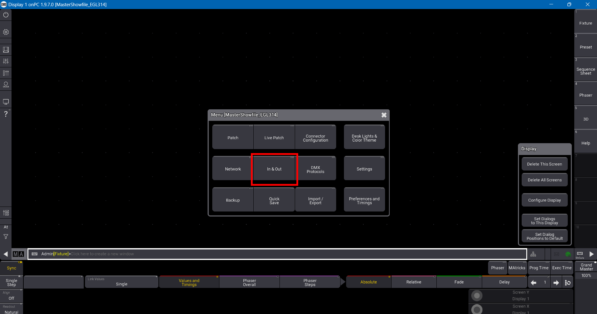
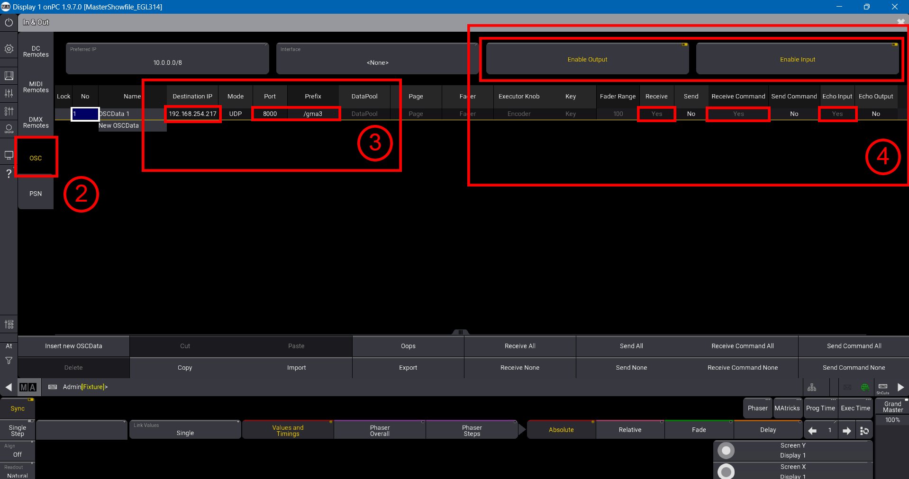
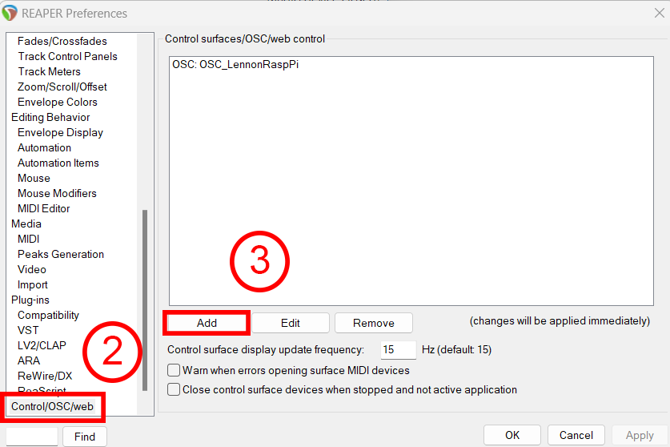
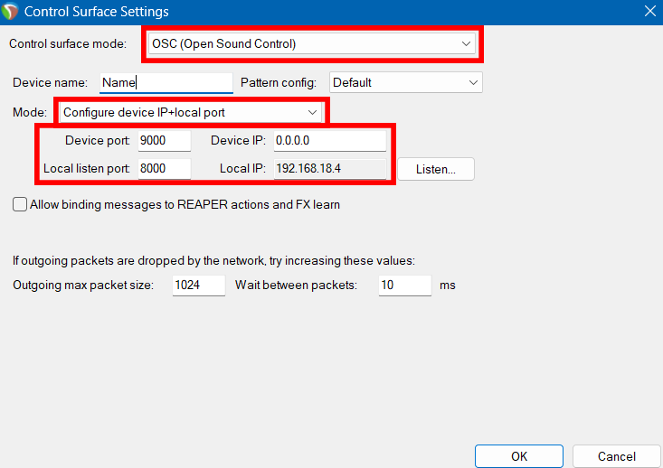

<h1 align="center">
  Installation Guide
</h1>

<p align="center">

 <i align="center">Installation guide for Station 5 - Memory Sequence. </i>
</p>

### Table Of Contents 📚

- [Overview](#overview) 📃
- [Raspberry Pi Configuration](#rasp-pi) ⚙️
- [grandMA3 Configuration](#grandma3) 💡
- [Reaper Configuration](#reaper) 🎛️
- [Launchpad Configuration](#launchpad) 📱
- [References](#references) 📋

## <a id="overview"> Overview 📃</a>

This installation guide serves to build the foundation of our project. It will heavily revolve around PythonOSC as it is our method of control.

Before installation, it is important to have the following software on your device(s):

- [grandMA3 on PC](https://www.malighting.com/downloads/products/grandma3/) (This is the software to run and control lighting sequences)
- [LoopMIDI](https://www.tobias-erichsen.de/software/loopmidi.html) (Create virtual loopback MIDI ports to connect apps needing MIDI ports for communication)
- [Reaper DAW](https://www.reaper.fm/download.php) (Digital Audio Workstation for inserting sound effects)
- [L-ISA Controller](https://www.l-acoustics.com/products/l-isa-studio/) (Spatial object mixing software to create an immersive soundscape)
- L-ISA Processor (Installed with L-ISA Controller)

Additionally, a [Launchpad](https://novationmusic.com/search.php?search_query=launchpad) is used in our set-up.

References can be found below.

## <a id="rasp-pi"> Raspberry Pi Configuration ⚙️</a>

Unfortunately with default configurations, it isn't possible to control grandMA3 or Reaper due to restrictions. To bypass them, it's necessary to download a virtual environment on your Raspberry Pi.

1) Install Python virtual environment

```
sudo apt install virtualenv python3-virtualenv -y
```

2) Create a new virtual environment

```
virtualenv -p /usr/bin/python3 <environment_name>
```

3) Activate the virtual environment

```
source <environment_folder>/bin/activate
```

4) Install the PythonOSC package

```
pip3 install python-osc
```

### Optional:

- Deactivate the virtual environment

```
deactivate
```

- Copy the virtual environment

First, generate a requirement file at the current working directory.

```
pip3 freeze > requirements.txt
```

Next, install dependencies in new enviroment

```
source <environment_folder>/bin/activate
```

```
pip3 install -r ~/<directory>/requirements.txt
```
## <a id="grandma3"> grandMA3 Configuration 💡</a>

1) After launching grandMA3, head over to `Settings` > `In & Out`



2) Head to `OSC` Tab

3) Ensure IP address, port and prefix are set as needed. It is advised to set the prefix to `gma3`.

4) `Enable Output`, `Enable Input`, `Receive`, `Recieve Command`, `Echo Input` should all be enabled, as Raspberry Pi will be sending OSC commands to grandMA3.



### Raspberry Pi to grandMA3 🔗
1) Create a file directory.
```
mkdir <directory_name>
```

2) Copy this [sample file](https://github.com/huats-club/oscstarterkit/tree/main/tutorial5/grandma.py) and insert it into your directory.

3) Remember to change `LAPTOP_IP` to your laptop IP, and ```PORT``` you set on grandMA3 earlier.

```
if __name__ == "__main__":
    LAPTOP_IP = "192.168.0.100"		# send to laptop w grandMA3
    PORT = 8000                     # laptop w grandMA3 port number
```
4) Run the file.
```
python3 grandma.py
```

## <a id="reaper">Reaper Configuration 🎛️</a>

1) Use the shortcut `Ctrl+P` to go to Reaper Preferences 
2) Scroll all the way to the bottom to Control/OSC/Web
3) Click on `Add` to add a new OSC device 



4) Configure the settings as such:

- Control Surface Mode set to `OSC (Open Source Control)`
- Mode set to `Configure device IP+local port`
- Device port set to Transmit Port number
- Local listen port set to Receive Port number
- Device IP set to `0.0.0.0`
- Local IP set to your laptop's IP address



### Raspberry Pi to Reaper 🔗

1) Create a file directory.
```
mkdir <directory_name>
```

2) Copy this [sample file for Reaper markers](https://github.com/huats-club/oscstarterkit/tree/main/tutorial8/marker_1.py) and this [sample file for Reaper playback](https://github.com/huats-club/oscstarterkit/tree/main/tutorial8/play_stop.py) and insert them both into your directory.

3) Edit the IP addresses of both files. `PI_A_ADDR` should be the laptop running Reaper, and ```PORT``` should be the local listen port/receive port number.

```
PI_A_ADDR = "10.10.10.10"
PORT = 6800
```

4) Run both files.

```
python3 marker_1.py
python3 play_stop.py
```

## <a id="launchpad">Launchpad Configuration 📱</a>

WIP

### Raspberry Pi to Launchpad 🔗

WIP

## <a id="references">References 📋</a>
Credits to [Huats Club](https://github.com/huats-club) for the references of installing Rasp Pi virtual environments and sample Python files. 

🔗 - [Virtual environment & PythonOSC installation](https://github.com/huats-club/mts_sensor_cookbook/blob/main/0.%20virtual_environment/venv.md)

🔗 - [grandMA3 Configuration](https://github.com/huats-club/oscstarterkit/tree/main/tutorial5)

🔗 - [Reaper Configuration](https://github.com/huats-club/oscstarterkit/tree/main/tutorial8)