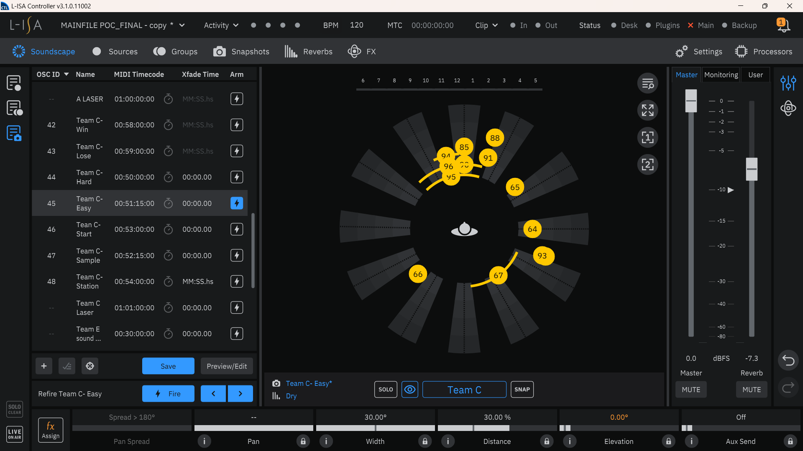

<h1 align="center">
L-ISA COntroller
</h1>

  <i align="center">
  Rundown of L-ISA Controller related files
  </i>

### Table Of Contents 📚

- [Overview](#overview) 📃
- [Files In Use](#files-in-use) 📂
- [Master L-ISA Controller file](#Master-Controller)

## <a id="overview"> Overview 📃</a>

L-ISA Controller is a desktop spatial object mixing audio processing tool for operating multichannel audio output with L-ISA Processors
It is 1 out of the 3 Open Source software used in this entire S.O.N.I.C project.
In our project, it is used for audio effects such as pan, distance, width, etc.

L-ISA Controller uses spatial metadata from L-ISA Processor (MTC timecode sync through MIDI with Reaper DAW).

## <a id="files-in-use"> Files In Use 📂</a>

📄 - [Master L-ISA Controller file](https://github.com/uselesskcid/EGL314-Project-S.O.N.I.C-Team-C-POC/tree/main/MVP/L-ISA_Controller/MAINFILE_POC_FINAL.lisa)

This the the L-ISA Controller file that runs on the Master Station Laptop. It contains not just the audio effects and soundscape creation for Station 5, but also the other 4 stations and 5 laser sequences.

## <a id="Master-Controller"> Master L-ISA Controller file </a>

For reference, the picture below shows the snapshots with the MIDI timecode time that our team used.

