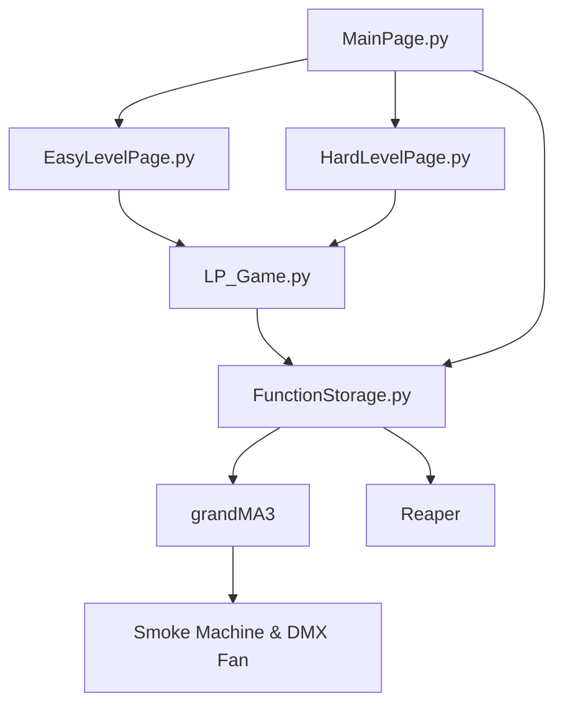
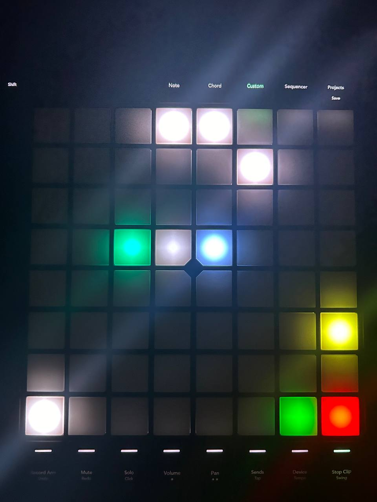
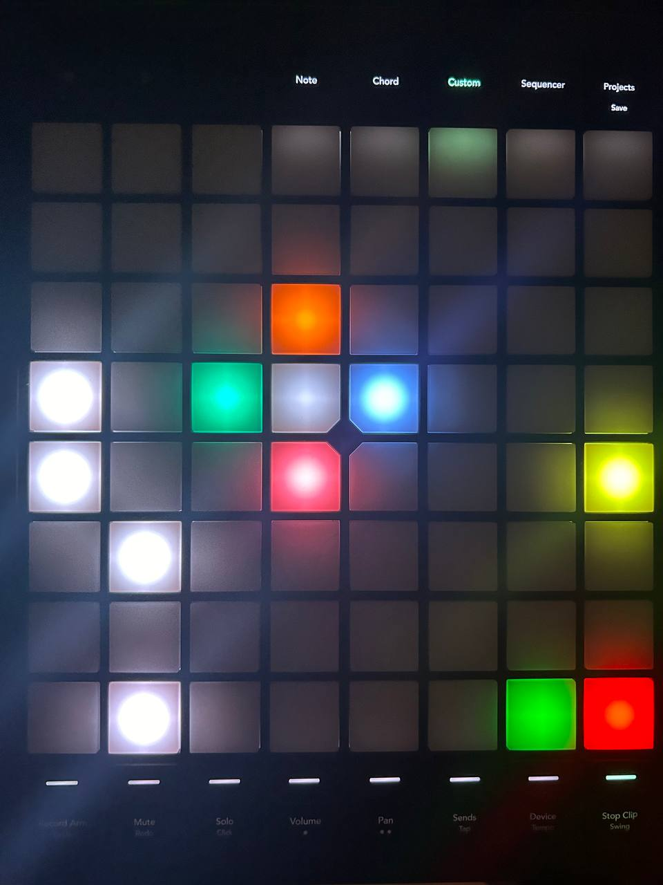

<h1 align="center">
Launchpad Documentation
</h1>

<p align="center">

 <i align="center">A rundown of how the Launchpad Pro MK3 is used in our project. </i>
</p>

### Table Of Contents 📚

- [Overview](#overview) 📃
- [Files In Use](#files-in-use) 📂
- [Code Hierarchy](#hierarchy) 👑
- [Level Overview](#level) 🎮

## <a id="overview"> Overview 📃</a>

For the **Memory Sequence**, we will be using the ***Launchpad Pro MK3*** as our MIDI touchpad. The game pad will have 2 gamemodes: easy and hard.

The player will be able to play using the central LED buttons on the Launchpad and switch between easy and hard mode.

They are supposed to hear the audio sequence when pressing the "Start Sequence" button to look out for the correct answer.

Once the audio marker has ended, they will press the submit button on the Launchpad to input their answers.

You are greeted with a single start buttton on the Launchpad.
 
 After the start button is pressed, the layout of the starting game mode will appear to signify the start of game. 
 
During each game mode, Players have to look out for audio cues and memorize the order of directions of the sound. 
- Inside the moving pixels are the direction inputs. The middle grey pixel represents the player's position

- On the bottom left corner lies the audio sequence play button. Once pressed, all inputs will be blocked temporarily.

-  After the audio sequence is finished, the player will be able to input their answers.

- The player must press the yellow submit button on the right side of the Launchpad to see whether they have inputted the correct answer. 


## <a id="files-in-use"> Files In Use 📂</a>

📄 - [Main Page](https://github.com/uselesskcid/EGL314-Project-S.O.N.I.C-Team-C-POC/blob/main/MVP/Codes/MVP_MainPage.py)

The main page of the game. Contains the suspense sequence to signify the 'activation' of the Ninja Pulse.

📄 - [Easy Level Page](https://github.com/uselesskcid/EGL314-Project-S.O.N.I.C-Team-C-POC/blob/main/MVP/Codes/MVP_EasyLevelPage.py)

The easy level page of the game.

📄 - [Hard Level Page](https://github.com/uselesskcid/EGL314-Project-S.O.N.I.C-Team-C-POC/blob/main/MVP/Codes/MVP_HardLevelPage.py)

The hard level page of the game.

📄 - [Launchpad Game Settings](https://github.com/uselesskcid/EGL314-Project-S.O.N.I.C-Team-C-POC/blob/main/MVP/Codes/MVP_LP_Game.py)

Used for keeping track of the player's inputs, as well as storing the answer keys. Also used for submit button functions and the triggering of win & lose sequences.

📄 - [Function Storage](https://github.com/uselesskcid/EGL314-Project-S.O.N.I.C-Team-C-POC/tree/main/MVP/Codes/MVP_FunctionStorage.py)

Used by the main page to trigger the suspense sequence at the start of the game. Also used by the launchpad game settings page to trigger the sequence in a win, and the lose sequence in a loss.

## <a id="hierarchy"> Code Hierarchy 👑</a>
Illustrating how the codes function together under the launchpad section.



## <a id="level"> Level Overview </a> 🎮

### Main file

The code file that we will only be running on our Raspberry Pi terminal is our **main file** which is the master file (`MVP_MainPage.py`) that sets up the whole game and  controls the running process of each individual game mode.

- The orange start button is coded inside the main file to start and load the whole game on the Launchpad.

- The functions of the two difficulty mode buttons are coded in the main file to switch between easy and hard mode. This means that the main file can load the easy or hard mode depending on which difficulty mode button the player presses.

- More modules are imported in this file such as ```time```, ```subprocess``` and ```threading``` in order to create functions to run one difficulty mode at a time.

### Easy mode file
The layout for easy mode shows up when the file `MVP_EasyLevelPage` is loaded. 
- Players can input the directions "Left" and "Right" with the input buttons.
- The code contains the design layout for Easy mode on the Launchpad. 
- The easy sequence play button on **Button ID 11** is coded with a function to play the easy mode audio sequence.
- Submit button on **Button ID 38** to submit the player's answers.



The easy mode consists of the most basic directions: Left and Right.

### Hard mode file
The layout for hard mode shows up when this file is loaded. 
- Players can input the directions "North", "South", "East" and "West" with the input buttons.
- The code contains the design layout for Hard mode on the Launchpad. 
- The easy sequence play button on **Button ID 12** is coded with a function to play the Hard mode audio sequence.
- Submit button on **Button ID 48** to submit the player's answers.



>The hard mode consists of four directions: North, South, East and West, with the playable buttons being inside the white circle.

### Button feedback (All files)

We can also receive input feedback on our Raspberry Pi when pressing the LEDs on the Launchpad as they can also act as buttons for sending messages to the Raspberry Pi.

When pressing a button:
- a message on the Rasberry Pi terminal is shown
- audio/ lighting sequences implemented into the code will play

In addition, when players press the input buttons:
-  The colour of the input buttons change colour to white when pressed
-  The button reverts back to its original supposed colour when let go

Generally when a button is pressed, the colour of the button blinks.
This is implemented to improve the user feedback.