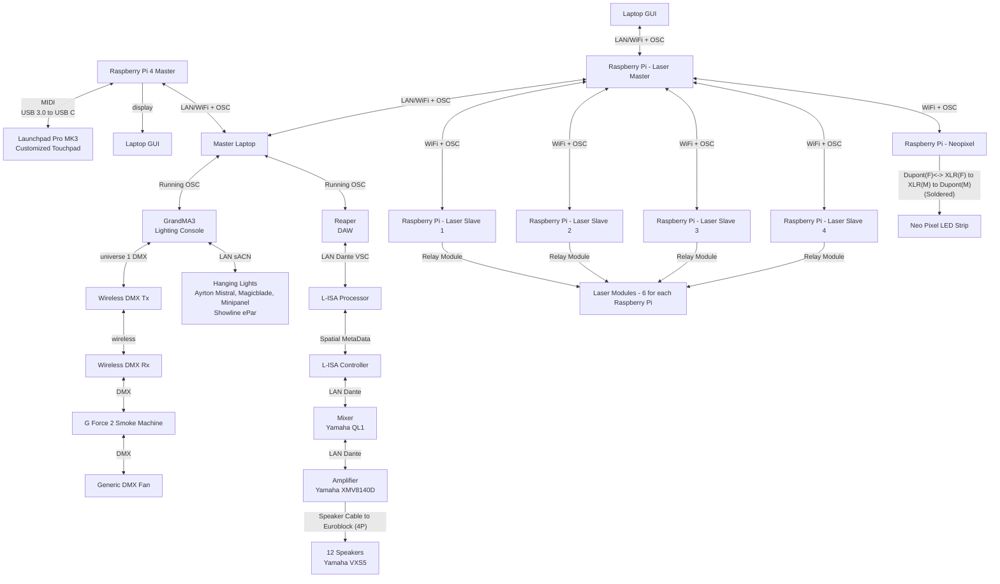

<<h1 align="center">
  Minimum Viable Product
</h1>

  <i align="center">
  a test of auditory Memory Sequence
  delivered by Team C
  </i>

## Overview
This repository folder contains all the notable assets, codes and others used for our Minimum Viable Product (MVP) in Week 14 that covers Station 5 - Memory Sequence.

In the Minimum Viable Product, we will be using a Master Station that is shared with the other teams. The Master Station hosts 3 different open-source softwares and they are Reaper DAW, L-ISA Controller and GrandMA3. There are 12 speakers in a 10 by 10 meters room and the participant will be standing in the center of the room to play their game.

For the Minimum Viable Product, the demonstration will feature a full run through of the game. This includes a introduction, 2 difficulty levels, followed by a win/lose sequence. There are 2 Graphical User Interface (GUI) used, one for the game and another for a laser sequence show displayed.

## Hardware & Software Setup

## Code Files
In this folder, there are multiple folders with files such as the python code files used as well as the master station software files.
They are seperated by their purposes.
Below, there are more detailed explanations of the codes in their respective uses.

<h2>Documentation</h2>

In the [Documentation](./Documentation) folder, you can find the [Installation Guide](./Documentation/Installation_Guide.md) and the [Installation Assets](./Documentation/installation_assets).

<h2>GrandMA3</h2>

In the [GrandMA3](./GrandMA3) folder, you can find the [GrandMA3 Rundown](./GrandMA3/GrandMA3.md) and the [GrandMA3 Master Show file ](./GrandMA3/MasterShowfile_EGL314_MVP_FINAL.show).

<h2>L-ISA Controller</h2>

In the [L-ISA Controller](./L-ISA_Controller) folder, you can find the [L-ISA Rundown](./L-ISA_Controller/L-ISA.md) and the [L-ISA Controller Master Show File](./L-ISA_Controller/MAINFILE_POC_FINAL_-_copy.lisa).

<h2>Laser Sequence</h2>

In the [Laser Sequence](./Laser_Sequence) folder, you can find the [Laser Rundown](./Laser_Sequence/Laser.md), the [Full Laser Sequence python file](./Laser_Sequence/MVP_Laser_Full.py) and the [Laser - Reaper python file](./Laser_Sequence/Reaper.py).

<h2>Launchpad (Ninja Pulse)</h2>

In the [Launchpad (Ninja Pulse)](./Launchpad_(Ninja_Pulse)) folder, you can find the [Launchpad (Ninja Pulse) Rundown](./Launchpad_(Ninja_Pulse)/Launchpad.md).

<h2>Reaper DAW</h2>

In the [Reaper DAW](./Reaper_DAW) folder, you can find the [Reaper Rundown](./Reaper_DAW/Reaper.md), the [Audio FXs](./Reaper_DAW/FXs), and the [Reaper DAW Master Show File](./Reaper_DAW/314MAINREAPER_POC_FINAL.rpp).

