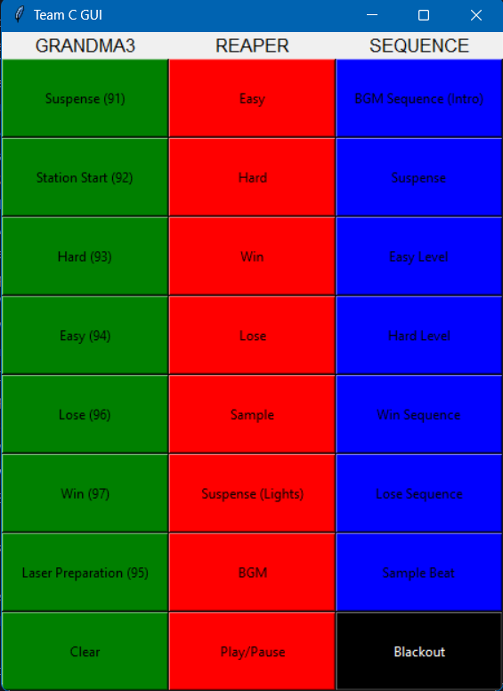

<h1 align="center">
Python Open Sound Control
</h1>

<p align="center">

 <i align="center">A rundown of how Python Open Sound Control (PythonOSC) is used in our project. </i>
</p>

### Table Of Contents 📚

- [Overview](#overview) 📃
- [Files In Use](#files-in-use) 📂
- [Function Storage](#function-storage) 🗄️
- [Main GUI](#gui) 📟

## <a id="overview"> Overview 📃</a>

PythonOSC implements a server and client for Open Sound Control. It allows for Python access to a versatile protocol used in controller hardware and control applications.

In our project, it's used to control grandMA3, Reaper, and the laser modules from either our Raspberry Pis or our laptops.

To begin, we create an OSC Client to send messages to the receipient, which is the software we used. Afterwards, we send an OSC message to the receipient, which can be customised to fit our needs.

```
from pythonosc import udp_client

def send_message(receiver_ip, receiver_port, address, message):
	try:
		# Create an OSC client to send messages
		client = udp_client.SimpleUDPClient(receiver_ip, receiver_port)

		# Send an OSC message to the receiver
		client.send_message(address, message)

		print("Message sent successfully.")
	except:
		print("Message not sent")
```

## <a id="files-in-use"> Files In Use 📂</a>

📄 - [Function Storage](https://github.com/uselesskcid/EGL314-Project-S.O.N.I.C-Team-C-POC/tree/main/MVP/OSC/MVP_FunctionStorage.py)

The body of the project. Connects almost everything together.

📄 - [Main GUI](https://github.com/uselesskcid/EGL314-Project-S.O.N.I.C-Team-C-POC/tree/main/MVP/OSC/MVP_MainGUI.py)

The main GUI of the project. Capable of controlling grandMA3 and Reaper.
## <a id="function-storage"> Function Storage 🗄️</a>

The Function Storage stores all functions we need to control <b>grandMA3 sequences</b> and <b>controlling Reaper</b> via its playback and jumping of markers.

### grandMA3

The IP addresses, ports, and addresses remain constant throughout. It's defined as `MA3_IP`, `MA3_PORT` and `MA3_ADDR` respectively to avoid confusion with the Reaper settings.

Only the message changes to switch to the specified sequence.

```
# GRANDMA3 SETTINGS RIGHT HERE
MA3_IP = "192.168.254.229"		# MA3 laptop IP
MA3_PORT = 8888 # GRANDMA3 Local listen port
MA3_ADDR = "/gma3/cmd" # Trigger TRUE Value
# msg = "Go Sequence X"
```

The functions follow a formula:
1) Turn off any sequence running if any, to prevent sequences and lights clashing.
2) Run the intended sequence.

```
def MA3_SeqX():
	send_message(MA3_IP, MA3_PORT, MA3_ADDR, "Off MyRunningSequence")
	send_message(MA3_IP, MA3_PORT, MA3_ADDR, "Go+: Sequence X")
	print('Sequence X played')
```

### Reaper

The IP addresses, ports, and messages remain constant throughout. It's defined as `REA_IP`, `REA_PORT` and `REA_MSG` respectively to avoid confusion with the grandMA3 settings.

Only the address changes to activate an action or jump to a marker on the timeline.

```
# REAPER SETTINGS RIGHT HERE
REA_IP = "192.168.254.30"		# REAPER laptop IP
REA_PORT = 6800 # REAPER Local listen port
REA_MSG = float(1) # Trigger TRUE Value
# addr = "/action & /marker"
```

Just like grandMA3, Reaper functions follow a formula:
1) Jump to a specified marker.
2) Play Reaper ("/action/1007") OR pause Reaper ("/action/1008")

```
def REA_JumpX(): #Marker X
	send_message(REA_IP, REA_PORT, "/marker/"+str(fm+y), REA_MSG)
	send_message(REA_IP, REA_PORT, "/action/1007", REA_MSG)
```

### Sequence

The <b>Sequence</b> section combines certain grandMA3 and Reaper functions together, along with added time functions to pause Reaper playback after a certain period of time.

For example:

```
def SEQ_Intro(): # Act 1 - Intro to our station with BGM
	MA3_Seq92()  # Sequence 92
	REA_JumpBGM() #Reaper 45, L-ISA 48
	time.sleep(120)
	REA_Pause()
```

When `SEQ_Intro` is activated, the functions `MA3_Seq92` (runs Sequence 92 on grandMA3) and `REA_JumpBGM` (jumps to the Reaper marker playing the background music) is called. After 120 seconds, the `REA_Pause` function is called, signalling the pausing of Reaper.

This helps to simplify understanding and changing of code, as well as reduce the amount of hard-coding, allowing for easier flexibility.

## <a id="gui"> GUI 📟</a>

After all necessary functions are defined, the Main GUI imports most of them in the Function Storage, and displays them in an easy to use interface.

The GUI is only intended to be used by us operating the station, and not to be used by players.



The `Blackout` button clears all grandMA3 sequences and pauses the Reaper playback.