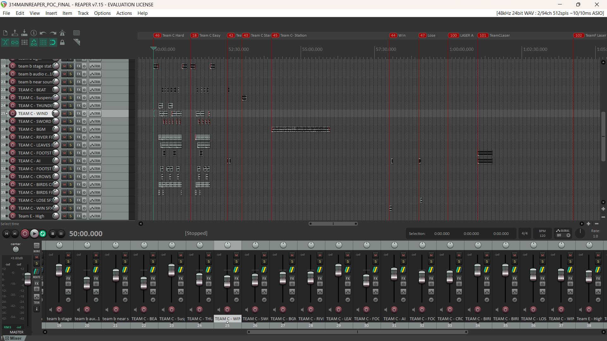

<h1 align="center">
Reaper DAW
</h1>

  <i align="center">
  Rundown of Reaper DAW related files
  </i>

### Table Of Contents 📚

- [Overview](#overview) 📃
- [Files In Use](#files-in-use) 📂
- [Code Hierarchy](#hierarchy) 👑
- [Audio FXs](#FXs)
- [Master Reaper DAW file](#Master-Reaper)

## <a id="overview"> Overview 📃</a>

Reaper DAW is a digital audio workstation and MIDI sequencer application.
It is 1 out of the 3 Open Source software used in this entire S.O.N.I.C project.
In our project, it is used for audio tracks mixing and editing, as well as being the timecode master.

To begin with, a MTC timecode generator in Reaper DAW is used to sync the L-ISA Processor.
Open Source Control (OSC) messages are sent from a Raspberry Pi to Reaper DAW through its [Control/OSC/Web Configuration](https://github.com/uselesskcid/EGL314-Project-S.O.N.I.C-Team-C-POC/tree/main/MVP/Documentation/Installation_Guide.md/#reaper).

## <a id="files-in-use"> Files In Use 📂</a>

🔊 - [Audio FXs ](https://github.com/uselesskcid/EGL314-Project-S.O.N.I.C-Team-C-POC/tree/main/MVP/Reaper_DAW/FXs.py)

This folder contains every audio effect used in the creation of the audio tracks, mixing and soundscape.

📄 - [Master Reaper DAW file](https://github.com/uselesskcid/EGL314-Project-S.O.N.I.C-Team-C-POC/tree/main/MVP/Reaper_DAW/314MAINREAPER_POC_FINAL.rpp)

This the the Reaper DAW file that runs on the Master Station Laptop. It contains not just the audio tracks and audio mixing for Station 5, but also the other 4 stations and 5 laser sequences.

## <a id="hierarchy"> Code Hierarchy 👑</a>

## <a id="FXs"> Audio FXs </a>

Audio FXs used for Easy/Hard Level soundscape creation:
[bird wing flapping](./FXs/bird%20wing%20flapping%20fx.mp3)
[birds chirping](./FXs/birds%20chirping%20fx.mp3)
[footsteps 1](./FXs/footstep%201%20fx.mp3)
[footsteps 2(fast)](./FXs/footsteps%202%20(fast)%20fx.mp3)
[river flowing](./FXs/river%20flowing%20fx.mp3)
[shuriken beat](./FXs/shuriken%20fx.wav)
[sword slash](./FXs/sword%20slash%20fx.mp3)
[thunder](./FXs/thunder%20fx.mp3)
[wind howling](./FXs/wind%20howling%20fx.mp3)

Audio FXs used for Introduction soundscape creation:
[AI voice](./FXs/AI%20voice%20-%20sample%20beat.wav)
[taiko drums bgm](./FXs/taiko%20drums%20bgm%20-%20for%20intro.wav)
[suspense drums](./FXs/suspense%20drums%20fx.wav)

Audio FXs used for Introduction soundscape creation:
[Laser Song Main](./FXs/high%20hopes%20(bass%20boosted)%20-%20laser%20song%201.mp3)
[Laser Song Alternative](./FXs/'i_want_to_be_ninja'%20-%20laser%20song%202.wav3)

## <a id="Master-Reaper"> Master Reaper DAW file </a>

For reference, the picture below shows the section of time frame that our team has used.

Memory Sequence Time Frame starts at 50:00:00 and ends at 59:00:00.
Team C Laser Sequence Time Frame starts at 1:01:00:00 and ends at 1:01:30:00.
