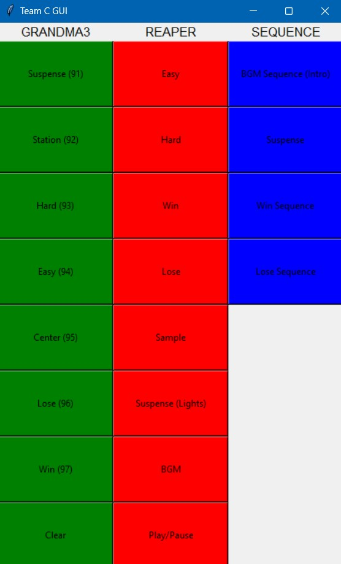

<h1 align="center">
Station Master GUI
</h1>

<i align="center">Graphical User Interface for station masters only (NOT for users) </i>

## Related files

[POC_FunctionStorage.py](https://github.com/uselesskcid/EGL314-Project-S.O.N.I.C-Team-C-POC/blob/main/Reaper%20%2B%20GrandMA3/OSC/POC_FunctionStorage.py) - The storage for all functions and sequences. The GUI file imports the commands from this storage, and successfully executes them when corresponding buttons are pressed.

## Overview

This python file allows for station masters to find and execute OSC commands to grandMA3 or Reaper DAW. This acts as manual control to fire all requried commands.

grandMA3 commands are fired from GUI to activate lighting sequences, such as a win and/or lose sequence.

Reaper DAW commands are fired from GUI to jump to a specific marker(timeframe) on the master reaper file, along with the option of playing and pausing the timecode.

Since the Reaper DAW master-file is heavily tied to L-ISA Controller & Processor through the use of MTC MIDI timecode, by playing on a specific timeframe in Reaper, the snapshots in L-ISA Controller will also play in sync with Reaper. Hence, only 2 softwares are being controlled via the GUI.

## Layout

The GUI is split into three sections:
1) grandMA3
2) Reaper
3) Sequence

The grandMA3 section has functions that enter 'Go' to a corresponding lighting sequence, triggering it, as well as a Clear function to clear all running sequences.

The Reaper DAW section has functions that jump to certain markers on the Reaper master file, as well as a Play/Pause button for playing or pausing the project.

The sequence section is a culmination of both grandMA3 and Reaper, used to create sequences that utilise the power of both softwares.
