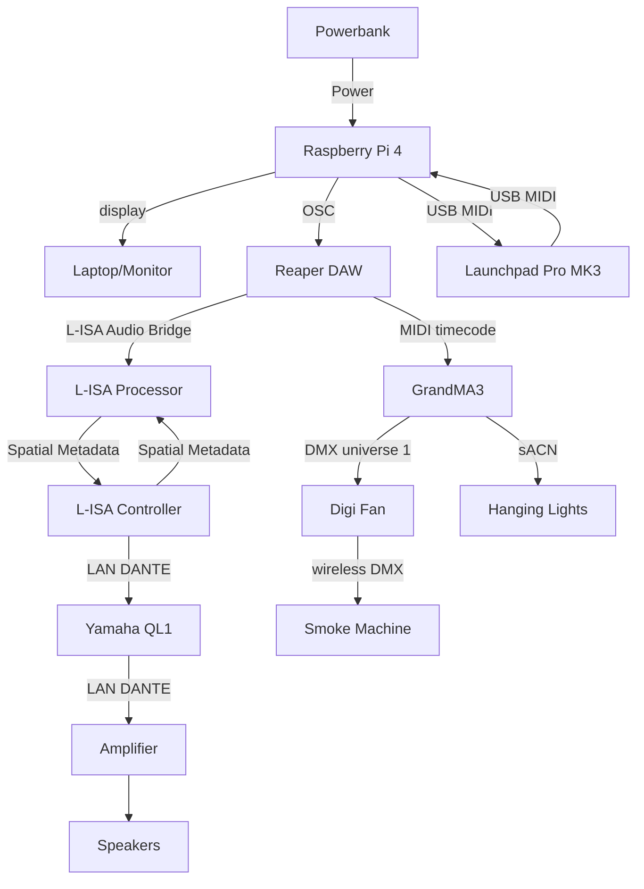

<h1 align="center">
  Project S.O.N.I.C - Activity 5 – Memory Sequence
</h1>

  <i align="center">Test and train your auditory memory with the use of modern technologies 🥷</i>

  

## Overview
Project S.O.N.I.C (Sensory Observation Ninja Immersive Challenge) is an experiential/exploratory initiative designed to blend the ancient "ninja training techniques" with modern technologies. Students are to design a range of interactive stations that simulate ninja training scenarios, designed to test and enhance your listening abilities, reaction times and strategic thinking. The stations include:
1. Stealth Walking
2. The Blindfold Challenge
3. Art Of Hearing
4. Reaction Training
5. **Memory Sequence** (Team C)
6. Graduation Sequence

  In this repository, the focus will be strictly on Station 5 - Memory Sequence.

## Station 5 - Memory Sequence
“Memory Sequence” test and train your auditory memory. 
Participants are to listen, remember, and replicate complex sequences of sounds. 
Player to interact with a 360° customized touchpad to indicate the memory sequence. 
 
Only one Player interacting with MIDI Launchpad Pro MK3 (360° customized touchpad).  

## System Diagram

  Features

<ul>
  <li>L-ISA to create distinct sequences of sounds that vary in parameters (e.g. localizations, frequencies, etc) </li>
  <li>Adjustable difficulties where sequences can gradually increase in complexity (e.g. length, pitch, etc). </li>
  <li> Interactive Feedback – teams may consider integrating visual and tactile feedback as hints or penalties. </li>
</ul>

## Credits
Team C would like to specially thank, <a href="https://github.com/ywfumav" title="ywfumav"><strong>Mr. Fu YongWei</strong></a>   from **Nanyang Polytechnic** for overseeing our project phase and supplying us with base-source codes.

## Contributors to this Project:
[//]: contributor-faces
Team Members: 
<a href="https://github.com/uselesskcid"><strong> Dick (Team Leader)</strong></a> 
<a href="https://github.com/ihave10minutes"><strong> Lennon (Co-Lead)</strong></a> 
<a href="https://github.com/Robloxer9000"><strong> Quan Feng (Member)</strong></a> 
 
 
Open Source Contributors: 
<a href="https://github.com/tl0wh"><strong> Travis (Classmate)</strong></a> 