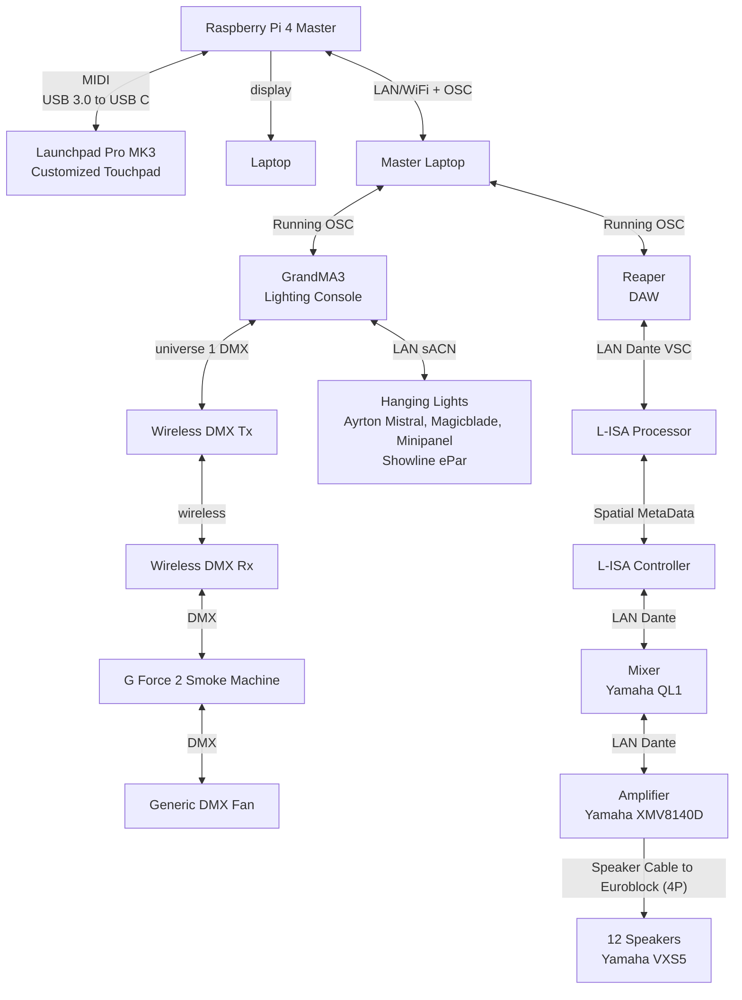

<h1 align="center">
  Project S.O.N.I.C:
   Station 5 – Memory Sequence
</h1>

  <i align="center">Test and train your auditory memory with the use of modern technologies! 🥷</i>

  

## Table Of Contents 📚

<b>

- [Overview](#overview) 📃
- [About](#about) ⓘ
- [Directory](#directory) 🗂️
- [System Diagram](#sys-diag) 📔
- [Contributors](#contributors) 👥
- [Credits](#credits) 🙏

</b>

## <a id="overview"> Overview 📃</a>

Project S.O.N.I.C (Sensory Observation Ninja Immersive Challenge) is an experiential/exploratory initiative designed to blend the ancient "ninja training techniques" with modern technologies.

Students are to design a range of interactive stations that simulate ninja training scenarios, designed to test and enhance your listening abilities, reaction times and strategic thinking. The stations include:
1. Stealth Walking
2. The Blindfold Challenge
3. Art Of Hearing
4. Reaction Training
5. **Memory Sequence** (Team C)

This repository will focus strictly on the fifth station, the Memory Sequence.

## <a id="about"> About ⓘ </a>
The Memory Sequence tests and trains your auditory memory.
Participants are to listen, remember, and replicate complex sequences of sounds.

Player to interact with a 360° customized touchpad to indicate the memory sequence.

Only one player interacting with MIDI Launchpad Pro MK3 (360° customized touchpad).

  Features

<ul>
  <li>L-ISA to create distinct sequences of sounds that vary in parameters (e.g. localizations, frequencies, etc) </li>
  <li>Adjustable difficulties where sequences increase in complexity</li>
  <li> Interactive Feedback – players will be blasted with smoke if they lose </li>
</ul>

## <a id="directory"> Directory 🗂️</a>

### 💯 ☑️ ▶️ [Full Documentation](https://github.com/uselesskcid/EGL314-Project-S.O.N.I.C-Team-C-POC/blob/main/Final_Presentation/FinalPresentation.md)  ◀️ ☑️ 💯

For a proper and thorough walkthrough of our station, please click the link above. All codes, assets, pictures, guides, and in-depth explanations can be found there. This fully reflects our final piece of work in its concluded form.

### Legacy
Previous attempts at documentation can be found [here]() (Proof of Concept) and [here](https://github.com/uselesskcid/EGL314-Project-S.O.N.I.C-Team-C-POC/blob/main/MVP/MVP.md) (Minimum Viable Product). Both versions are deliberately left incomplete and visible to showcase our progress since.
<!-- Change this?? --->

## <a id="sys-diag"> System Diagram 📔</a>

## <a id="contributors"> Contributors 👥</a>
[//]: contributor-faces

### Team Members: 
<a href="https://github.com/uselesskcid"><strong> Dick (Team Leader)</strong></a> 
<a href="https://github.com/ihave10minutes"><strong> Lennon (Co-Lead)</strong></a> 
<a href="https://github.com/Robloxer9000"><strong> Quan Feng (Member)</strong></a> 
 

### Open Source Contributors: 
<a href="https://github.com/tl0wh"><strong> Travis (Classmate)</strong></a> 

## <a id="credits"> Credits 🙏</a> 
Our team would like to specially thank:

<a href="https://github.com/ywfumav" title="ywfumav"><strong>Mr. Fu YongWei</strong></a> from **Nanyang Polytechnic** for overseeing our project phase and supplying us with base-source codes.

<a href="https://github.com/huats-club"><strong>Huats Club</strong></a> for many references in our installation.